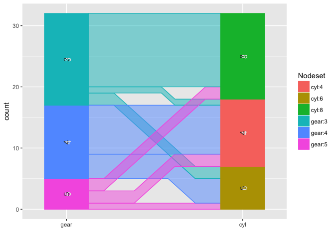

ggparallel implements and combines different types of parallel
coordinate plots for categorical data: hammock plots, parallel sets
plots, common angle plots, and common angle plots with a hammock-like
adjustment for line widths.

    library(ggparallel)
    data(mtcars)

    ggparallel(list("gear", "cyl"), data=mtcars)

    ggparallel(list("gear", "cyl"), data=mtcars, method="hammock", ratio=0.25)

