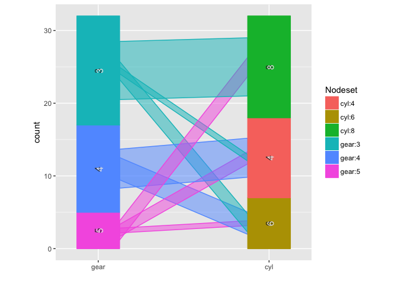

# ggparallel package
Heike Hofmann, Marie Vendettuoli  
December 2, 2016  


[](http://cran.r-project.org/package=ggparallel)
[](http://www.r-pkg.org/pkg/ggparallel)
[](https://travis-ci.org/heike/ggparallel)

ggparallel implements and combines different types of parallel coordinate plots for categorical data: hammock plots, parallel sets plots, common angle plots, and common angle plots with a hammock-like adjustment for line widths.


```r
library(ggparallel)
data(mtcars)

ggparallel(list("gear", "cyl"), data=mtcars)
```

<!-- -->

```r
ggparallel(list("gear", "cyl"), data=mtcars, method="hammock", ratio=0.25)
```

<!-- -->
