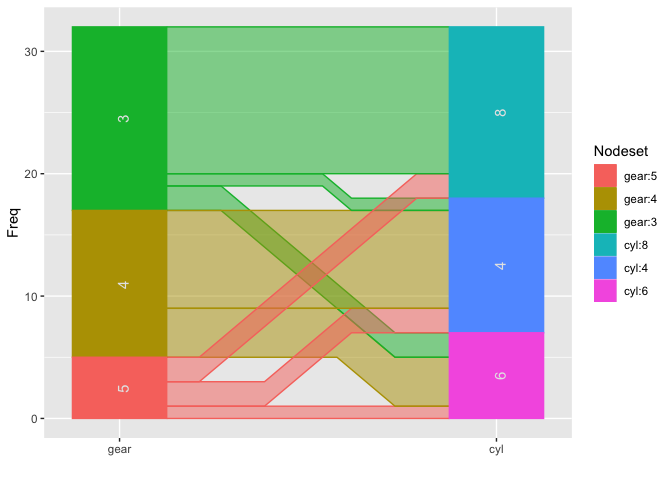
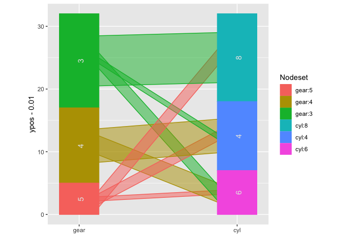

<!-- README.md is generated from README.Rmd. Please edit that file -->

# ggparallel

<!-- badges: start -->

[](https://CRAN.R-project.org/package=ggparallel)
[](https://r-pkg.org/pkg/ggparallel)
[](https://github.com/heike/ggparallel/commits/main)
[](https://codecov.io/gh/heike/ggparallel)
[](https://github.com/heike/ggparallel/actions/workflows/R-CMD-check.yaml)
<!-- badges: end -->

The R package `ggparallel` implements and combines different types of
parallel coordinate plots for categorical data: [hammock
plots](http://www.schonlau.net/publication/03jsm_hammockplot_old.pdf),
[parallel sets
plots](https://datavizcatalogue.com/methods/parallel_sets.html), and
[common angle plots](https://ieeexplore.ieee.org/document/6634157), as
well as common angle plots with a hammock-like adjustment for line
widths.

## Installation

The package is available on CRAN:

    install.packages("ggparallel")

You can install the development version of ggparallel from
[GitHub](https://github.com/) with:

    # install.packages("remotes")
    remotes::install_github("heike/ggparallel")

## Basic use case

``` r
library(ggparallel)
#> Loading required package: ggplot2
data(mtcars)

ggparallel(list("gear", "cyl"), data=mtcars)
```



``` r
ggparallel(list("gear", "cyl"), data=mtcars, method="hammock", ratio=0.25)
```


